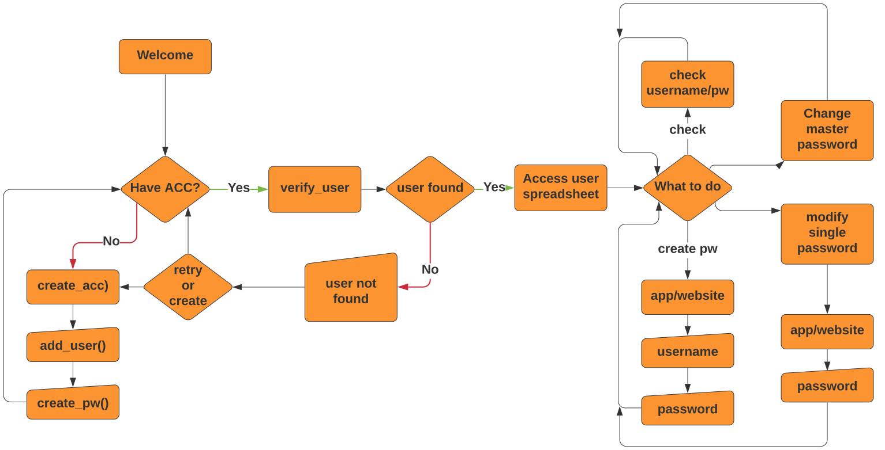
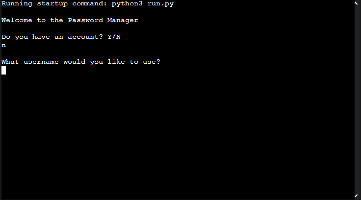
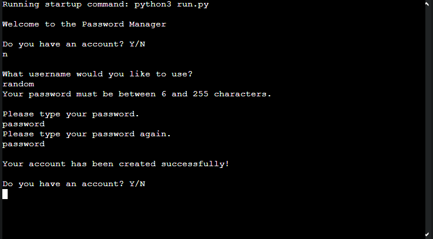
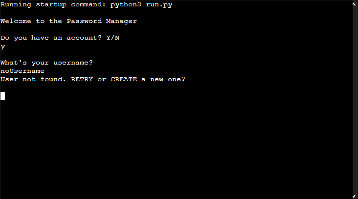
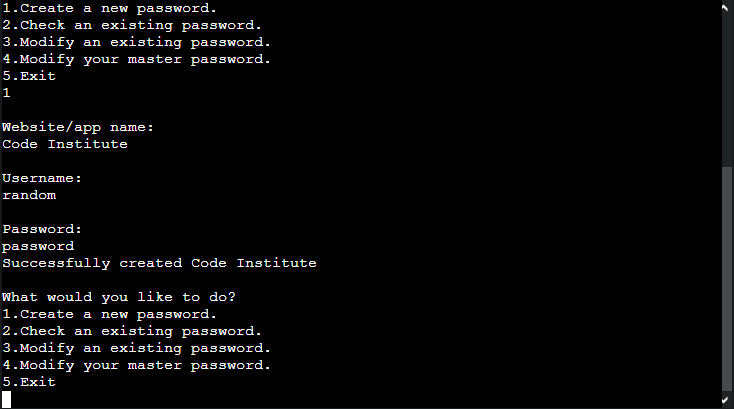
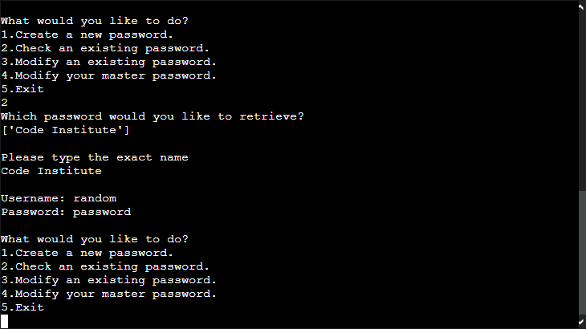
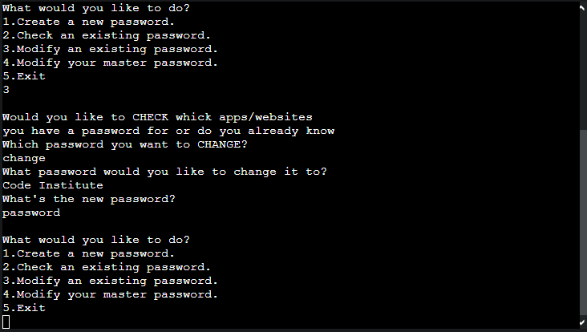
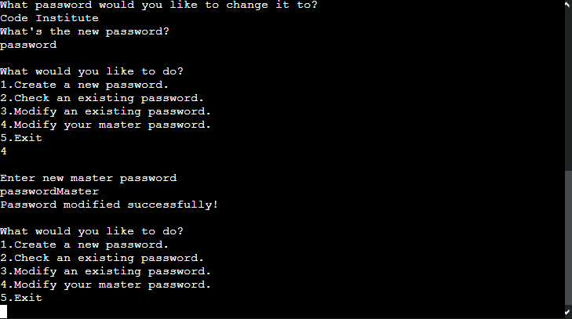

# Password Vault
 
## Overview
The main focus of this project is to develop a password vault for storage of previously generated passwords, ideally using the [Password Generator](https://nellymaw.github.io/password-generator/) created for the portfolio project 2. 

This program can create a new master account, with a unique username and personalized password, change the master password in case of need, it can also create and modify new items inside itself (i.e. Facebook account, Slack account), it also able to display the passwords stored within it.

## User stories
As an user of this program I would like to:
1. Create an account and be able to log back into it whenever necessary.
2. Be prompted with options if I enter the wrong username/password.
3. Have the option to create a new item containing username and password inside my vault.
4. Check what items are stored in my vault.
5. Have the option to change a password that is already stored in my vault.
6. Be able to change my account's password.
7. Be able to close the program and be prompted that it has been closed.

## Design
### Flowchart


## Data Model
The user used throughout the second half of the program's run contains 3 values <CELL RowN#ColN# "Value"> this data type is automatically generated via Gspread.

Through the program's code, the value is used to locate rows and columns and also values on occasion to pinpoint where the next logical step for the program is.

## Testing
I have manually tested the project by doing the following:
- Passed the code through a PEP8 linter and confirmed that there are no errors.
- Given invalid inputs, passwords too long or too short, and inputs that shouldn't be used.
- Tested in my local terminal.

I Had it tested through Heroku by a third-party.

## Test Cases

- To create an account:
1. When starting the program you will be asked if you have an account as a Y/N question. Answer no.

    

2. You then will be asked what username you want, if it is not available you will be prompted to enter another username. If the username is available you will be taken to the next step

    

3. You will be asked to input a password and then if it is valid you will be asked to repeat your password. If every thing goes well you will have created your account.

    

*********************
- When your account's username/password is wrong you will be prompted with a choice of retrying your credentials or creating a new account.

    

*********************
- To create a new vault item firstly you need to create and/or log into your account, then when prompted with the 5 choices for your account you should choose number 1 (Create a new password).
The program will ask three question in order to create the item: What website/app is the password going to be used for, what username will you use on that website/app, and finally, what password will the account have.

    

*********************
- To check an existing password firstly you need to create and/or log into your account, then when prompted with the 5 choices for your account you should choose number 2 (Check an existing password), the program will print all itens available on your vault and ask what item would you like to retrieve. If the information provided is available it will print the username and password on the terminal.

    

*********************
- To modify an existing password inside the vault you need to create and/or log into your account, then when prompted with the 5 choices for your account you should choose number 3 (Modify an existing password).
You will the be asked if you know what item you want to modify or if you would like to check what passwords you have in your account.

    If you choose "CHECK" a list of items will be printed for you and you can then choose from there.

    If you choose "CHANGE" you will be asked what item you want to modify and what password should it be modified to.

    

*********************
- To modify your master password you need to create and/or log into your account, then when prompted with the 5 choices for your account you should choose number 4(Modify your master password).the program will ask what the new password should be and store it on your account's credentials.

    
*********************
- To exit the program whenever you are done with it's use choose the option 5 (Exit). the program will cease it's functionality (for all purposes loging you off) and prompting the user the the program has closed.

Quit the program

## Bugs
### Solved Bugs
- When a new user is created but there was already a user with the same username.
- If a search returned empty there would be an AttributeError, that has been resolved.
- User use empty username.
- Fix bug where new users could not log in.

### Known Bugs
- No known bugs remaining.

## Validator Testing
- PEP8 Linter - no serious errors were returned from PEP8online.com

## Deployment

### GitHub Pages

The project was deployed to GitHub Pages using the following steps...

1. Log in to GitHub and locate the [GitHub Repository](https://github.com/nellymaw/google-sheet-password-vault)
2. At the top of the Repository (not the top of the page), locate the "Settings" button on the menu.
3. Scroll down the Settings page until you locate the "GitHub Pages" Section.
4. Under "Source", click the dropdown called "None" and select "Master Branch".
5. The page will automatically refresh.
6. Scroll back down through the page to locate the now published site [link](https://github.com/nellymaw/google-sheet-password-vault) in the "GitHub Pages" section.

### Forking the GitHub Repository

By forking the GitHub Repository we make a copy of the original repository on our GitHub account to view and/or make changes without affecting the original repository by using the following steps...

1. Log in to GitHub and locate the [GitHub Repository](https://github.com/nellymaw/google-sheet-password-vault)
2. At the top of the Repository (not top of page) just above the "Settings" button on the menu, locate the "Fork" button.
3. You should now have a copy of the original repository in your GitHub account.

### Making a Local Clone

1. Log in to GitHub and locate the [GitHub Repository](https://github.com/nellymaw/google-sheet-password-vault)
2. Under the repository name, click "Clone or download".
3. To clone the repository using HTTPS, under "Clone with HTTPS", copy the link.
4. Open Git Bash
5. Change the current working directory to the location where you want the cloned directory to be made.
6. Type `git clone`, and then paste the URL you copied in Step 3.

```
$ git clone https://github.com/YOUR-USERNAME/YOUR-REPOSITORY
```

7. Press Enter. Your local clone will be created.

```
$ git clone https://github.com/YOUR-USERNAME/YOUR-REPOSITORY
> Cloning into `CI-Clone`...
> remote: Counting objects: 10, done.
> remote: Compressing objects: 100% (8/8), done.
> remove: Total 10 (delta 1), reused 10 (delta 1)
> Unpacking objects: 100% (10/10), done.
```
### Gitpod

1. Install the gitpod browser extension. [Gitpod Browser Extension](https://www.gitpod.io/docs/browser-extension/)
2. Go to the project repository. [Google sheet password vault](https://github.com/nellymaw/google-sheet-password-vault)
3. click the gitpod button beside the about section.  

## Credits
[GSpread user guide](https://docs.gspread.org/en/latest/user-guide.html)
[GSpread documentation](https://docs.gspread.org/en/latest/api.html)
[Stackoverflow](https://stackoverflow.com/questions/13949540/gspread-or-such-help-me-get-cell-coordinates-not-value)
[Stackoverflow](https://stackoverflow.com/questions/45134764/getting-all-column-values-from-google-sheet-using-gspread-and-python)
[Stackoverflow](https://stackoverflow.com/questions/40781295/how-to-find-the-first-empty-row-of-a-google-spread-sheet-using-python-gspread)